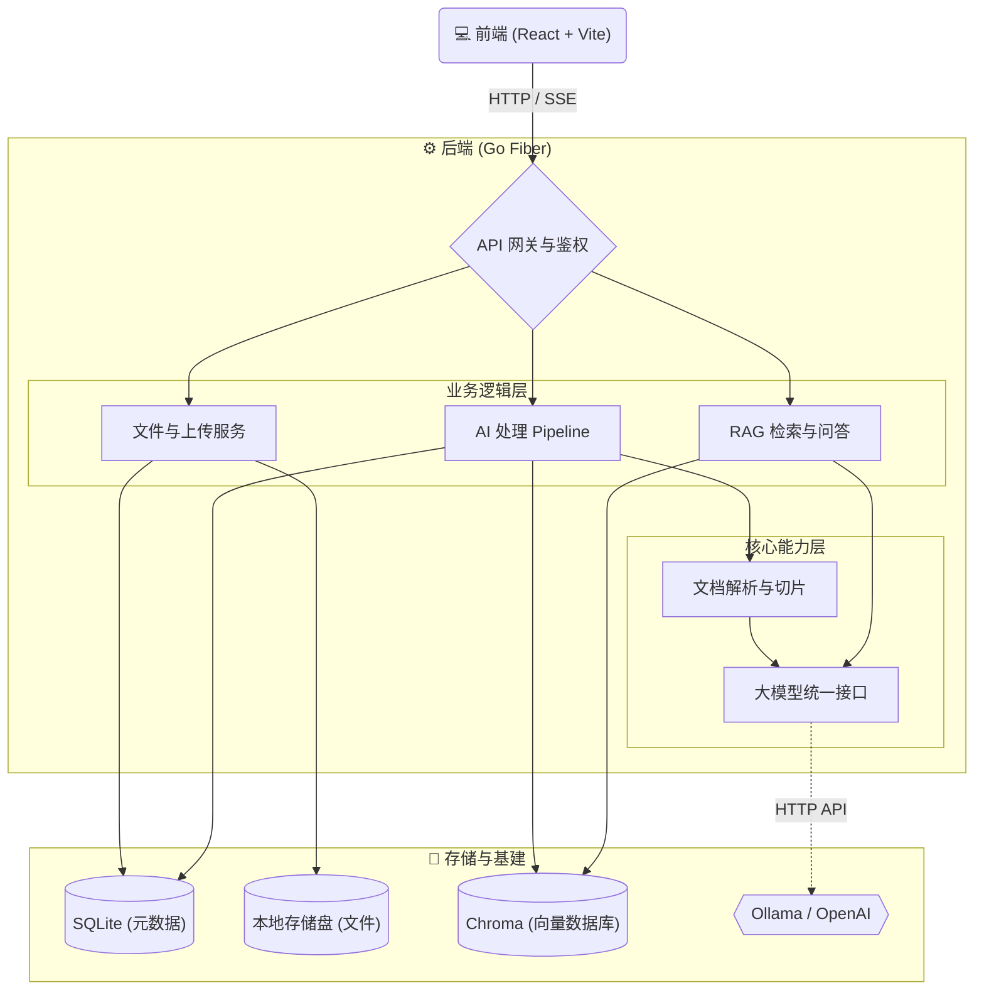

# MemoDrive

MemoDrive 是一个私有的、单用户的智能云盘。通过结合个人网盘的本地存储方案，并利用主流的大模型能力，在存储文件时，可根据文件类型，自动对文件进行 AI 处理，提取文件内容，构建向量索引，实现在 AI 时代下的网盘体验。

[English](./README.md) | [中文](./README-ZH.md)

## 当前已实现功能

- 单用户鉴权系统：通过 `ADMIN_PASSWORD` 控制，密码为空则无需登录即可访问。
- 可配置的存储选项：支持自定义存储根目录、SQLite 数据库路径、上传临时目录以及缩略图目录。
- 文件管理核心：文件列表、创建文件夹、重命名/移动 API、回收站软删/还原/永久删除，以及支持 HTTP Range 的断点下载。
- 大文件分片上传：支持分片上传、上传会话记录、断点续传、完成后自动合并，以及真实传输页进度、暂停/继续、取消和历史清理。
- 异步处理队列：文件上传后自动创建后台 Pipeline 任务进行处理。
- 媒体元信息提取：支持图片尺寸提取、JPEG EXIF 解析及缩略图生成。
- 音视频元信息提取：环境支持时自动调用 `ffprobe` 提取时长等元信息。
- 媒体文本入库：图片 OCR 默认开启并在安装 Tesseract 时自动提取文字；音频/视频转录可选接入 whisper.cpp 或 OpenAI 兼容 Whisper 接口。
- Pipeline 鲁棒性：支持启动期恢复中断任务、失败化卡住任务，并周期清理孤儿缩略图。
- 文档解析与智能切片：支持 PDF、DOCX、Markdown、纯文本解析，并按章节/段落进行滑动窗口切片。
- 大模型基础能力：支持 OpenAI 兼容接口与 Ollama Provider，并可根据 `OPENAI_API_KEY` 自动降级。
- 向量库基础能力：支持 ChromaDB collection 管理、向量入库、检索与删除。
- 现代化前端界面：基于 React 开发，包含登录页、文件管理、上传进度展示、文件预览、元数据面板及流式 AI 助手侧边栏。
- 智能搜索独立页：3 栏布局、常驻 AI 助手、历史会话抽屉，支持流式问答与语义检索切换。
- AI 会话持久化：自动落库 `conversations` / `messages`，支持历史会话列表、切换、重命名与删除。
- RAG 检索质量增强：多轮 query 改写、heading-aware 索引、动态分数过滤、多 query 扩展、关键词/向量混合检索与父子 chunk。
- Docker 全栈部署：提供针对前端、后端、Chroma 向量数据库及 Ollama 的 Docker Compose 一键启动方案。

## 系统架构



## 项目骨架结构

```text
MemoDrive/
├── frontend/                 # React + Vite + TailwindCSS 前端代码
│   ├── src/
│   │   ├── api/              # API 客户端封装 (auth, files, ai, upload)
│   │   ├── components/       # UI 组件库 (文件管理, AI 助手, 文件预览)
│   │   ├── hooks/            # 自定义 React Hooks (AI 对话, 分片上传)
│   │   ├── layouts/          # 页面布局结构 (MainLayout)
│   │   ├── pages/            # 核心路由页面 (DrivePage, LoginPage)
│   │   ├── stores/           # Zustand 全局状态管理
│   │   └── types/            # TypeScript 类型定义
│   ├── index.html            # Vite 入口 HTML 文件
│   └── nginx.conf            # 生产环境 Nginx 反向代理配置
│
├── backend/                  # Go + Fiber 后端代码
│   ├── cmd/server/           # 应用程序启动入口
│   ├── internal/
│   │   ├── config/           # 环境变量解析与全局配置管理
│   │   ├── handler/          # HTTP 路由处理 (鉴权, 文件, 上传, AI, 任务, 健康检查)
│   │   ├── llm/              # 大模型服务接口对接 (Ollama, OpenAI)
│   │   ├── middleware/       # Fiber 中间件 (JWT鉴权, CORS跨域, 接口限流)
│   │   ├── model/            # 数据库结构与对象模型
│   │   ├── parser/           # 文档与媒体解析器, OCR提取, 文本切片
│   │   ├── service/          # 核心业务逻辑实现 (文件, 上传, Pipeline, RAG检索, 搜索)
│   │   ├── store/            # SQLite 数据库持久化层操作
│   │   ├── vectordb/         # 向量数据库客户端交互 (Chroma)
│   │   └── worker/           # 异步任务处理线程池
│   ├── data/                 # 本地数据持久化目录 (含 DB, 文件, 不进 git 追踪)
│   └── Dockerfile            # 后端 Docker 构建配置
│
├── docker-compose.yml        # Docker Compose 核心服务编排文件
├── docker-compose.prod.yml   # Docker Compose 生产环境配置覆写
├── .env.example              # 环境变量配置模板文件
├── start.sh                  # macOS/Linux 一键启动脚本
└── start.ps1                 # Windows PowerShell 一键启动脚本
```

## 快速启动

我们提供了一个 `Makefile` 来统一管理多端部署与构建。查看所有可用命令：

```bash
make help
```

**1. 准备环境变量**

```bash
cp .env.example .env
```

打开 `.env`，至少设置以下变量：

| 变量 | 说明 |
|------|------|
| `ADMIN_PASSWORD` | 登录密码。留空则关闭鉴权（生产环境不推荐）。 |
| `JWT_SECRET` | JWT 签名密钥。**生产环境必须修改**，可用以下命令生成：`openssl rand -hex 32` |
| `OPENAI_API_KEY` | （可选）OpenAI 兼容 API Key。未设置时自动降级到本地 Ollama。 |

**2. 预建数据目录**（使用 `start.sh` 时自动完成，手动启动时需执行）

```bash
mkdir -p data/files data/db data/tmp data/thumbnails data/chroma data/ollama
```

**3. 一键启动（基于 Docker）**

```bash
make docker-up
```

或使用自动完成第 1~3 步的启动脚本：

```bash
# macOS / Linux
./start.sh

# Windows (PowerShell)
.\start.ps1
```

启动完成后，请在浏览器中打开 `http://localhost:3000`。

> **安全提示：** 若 `JWT_SECRET` 仍为默认值或 `ADMIN_PASSWORD` 为空，后端启动时会输出警告日志，可用 `docker compose logs backend` 查看。

## 生产环境 HTTPS（反向代理终止 TLS）

生产环境建议使用 compose 覆盖配置，所有外部流量通过 `edge` nginx 以 HTTPS 入口访问：

```bash
docker compose -f docker-compose.yml -f docker-compose.prod.yml up -d --build
```

生产 compose 覆盖的作用：
- 移除 `backend`、`chroma`、`ollama` 的宿主机端口绑定（仅内网通信）
- 新增 `edge` nginx 容器，在 `80`/`443` 上终止 TLS
- `/api/` 请求直接代理到 `backend:8080`（单跳，支持 SSE 流式响应）
- 其余请求代理到 `frontend:80`

**部署检查清单：**

1. **在 `.env` 设置强密钥：**
   ```bash
   JWT_SECRET=$(openssl rand -hex 32)
   ADMIN_PASSWORD=your-strong-password
   ```

2. **准备 TLS 证书，并在 `.env` 设置路径：**
   ```
   TLS_CERT_PATH=/path/to/fullchain.pem
   TLS_CERT_KEY_PATH=/path/to/privkey.pem
   ```

3. **确认 API 地址配置**（若 `VITE_API_BASE_URL` 已为 `/api` 则无需修改）：
   ```
   VITE_API_BASE_URL=/api
   ```
   > 前端与 API 同域时，`/api` 始终有效。仅在前后端跨域部署时才需写完整 URL。

4. **验证部署：**
   ```bash
   ./deploy/scripts/verify_tls_login.sh your-domain [your-password]
   ```
   脚本检查：HTTP→HTTPS 跳转、TLS 证书、HSTS 响应头、登录接口可用性。

5. **端口暴露对比：**

   | 服务 | 开发环境 | 生产环境 |
   |------|---------|---------|
   | Frontend | `3000`（宿主机） | 仅内网 |
   | Backend | `8080`（宿主机） | 仅内网 |
   | Chroma | `8000`（宿主机） | 仅内网 |
   | Ollama | `11434`（宿主机） | 仅内网 |
   | Edge nginx | — | `80`、`443`（宿主机） |

## 本地开发

通过 Makefile 分别启动前后端开发服务器：

```bash
# 终端 1：启动后端服务端 (端口 8080)
make dev-backend

# 终端 2：启动前端开发环境 (端口 3000)
make dev-frontend
```

## 构建与测试

```bash
# 构建前后端全量包
make build-all

# 后端交叉编译（跨平台打包）
make build-linux
make build-windows
make build-mac

# 运行单元测试
make test
```

# 核心未完成功能任务清单

- `[✓]` **优先级 1: 向量库与大模型基础集成 (VectorDB & LLM)**
    - `[✓]` 实现 `internal/vectordb/chroma.go`，包含 collection 管理、`Upsert`（入库）、`Query`（检索）和 `Delete`（删除）方法
    - `[✓]` 实现 `internal/llm/ollama.go`，接入本地 Ollama 的 Embedding 和流式 Chat 接口
    - `[✓]` 实现 `internal/llm/openai.go`，兼容 OpenAI 规范的 Embedding 和流式 Chat 接口
    - `[✓]` 完善 `internal/llm/provider.go`，优先使用 OpenAI 兼容接口并自动降级到 Ollama
- `[✓]` **优先级 2: 文档解析与智能切片 (Parser & Splitter)**
    - `[✓]` 引入 `github.com/ledongthuc/pdf`，完善 `internal/parser/pdf.go` 的 PDF 纯文本提取、页数上限与文本清洗逻辑
    - `[✓]` 通过轻量 ZIP/XML 方案实现 DOCX 文本提取，并增强 Markdown 与纯文本解析
    - `[✓]` 实现 `internal/parser/splitter.go`，提供滑动窗口、overlap、章节感知与中英文标点感知切片策略
    - `[✓]` 完善 `internal/parser/parser.go` 进行文件类型自动路由与不支持格式处理
- `[✓]` **优先级 3: 核心 AI Pipeline 串联 (Pipeline Service)**
    - `[✓]` 补充 `internal/service/pipeline_service.go` 的文档处理流程：解析文本 -> 文本切片 -> 批量 Embedding -> 存入 ChromaDB
    - `[✓]` 增加 `PIPELINE_EMBED_BATCH_SIZE` 批次配置，Embedding 批次失败自动重试一次
    - `[✓]` 更新文件和任务的进度状态 (UpdateTask Progress)
    - `[✓]` 删除文件时 best-effort 清理 ChromaDB 中对应的向量数据
- `[✓]` **优先级 4: RAG 与语义搜索后端服务 (RAG & Search)**
    - `[✓]` 实现 `internal/service/rag_service.go`：问题向量化 -> Chroma 检索相似片段 -> 组装 Prompt -> 调用 LLM 进行流式回复 (SSE)
    - `[✓]` 实现 `internal/service/search_service.go`：支持纯语义文本搜索，返回带文件引用信息的来源片段列表
- `[✓]` **优先级 5: 前端 AI 助手交互与 SSE 对接 (Frontend AI Assistant)**
    - `[✓]` 完善 `frontend/src/hooks/useAIChat.ts`，解析后端的 Server-Sent Events (SSE) 数据流，实现打字机效果
    - `[✓]` 完善 `frontend/src/components/AIAssistant/AIFloatyBall.tsx` 及其子组件 `ChatMessage.tsx`（支持 Markdown 渲染）
    - `[✓]` 完善 `SourceReference.tsx` 引用来源卡片的交互和跳转逻辑
- `[✓]` **优先级 6: 前端文件在线预览组件 (Frontend File Preview)**
    - `[✓]` 接入 `react-pdf` 完善 `PdfViewer.tsx` 在线预览能力
    - `[✓]` 完善 `ImageViewer.tsx` 的全尺寸图片查看和 EXIF 元信息展示面板
    - `[✓]` 完善 `VideoPlayer.tsx`、`AudioPlayer.tsx` 和 `CodeViewer.tsx` 的预览能力
- `[✓]` **优先级 7: 图片/OCR 等进阶增强 (OCR & Edge Cases)**
    - `[✓]` 实现基于 Tesseract 的图片 OCR，并复用 Pipeline 的 chunk -> embed -> Chroma 入库链路
    - `[✓]` 增加可选音频转录与视频音轨/关键帧文本提取，依赖缺失时安全降级
    - `[✓]` 增加启动期任务恢复、卡住任务清理、孤儿缩略图清理，以及文件/任务状态常量
- `[✓]` **优先级 8: 文件搜索（按文件名 / 内容 / EXIF 混合）**
    - `[✓]` 后端 `POST /api/files/search`：name LIKE + meta_json LIKE + 可选语义合并
    - `[✓]` 前端 DrivePage 顶部搜索框接通后端，结果列表带 `match_types` badge，可选"包含语义搜索"开关
- `[✓]` **优先级 9: 文件 / 目录 移动 + 重命名**
    - `[✓]` 修复目录重命名 / 移动后子节点 `path` 不更新的隐藏 bug（递归改写 + 同名冲突 409 + 自移子路径 409）
    - `[✓]` 前端 FileList 操作菜单加 `重命名 / 移动到… / 下载`，新增 RenameModal 与 MoveDialog
- `[✓]` **优先级 10: 回收站（软删 / 还原 / 永久删除 / 自动到期清理）**
    - `[✓]` schema 引入 `schema_migrations` 幂等迁移，`files` 增 `deleted_at / original_path / original_name`
    - `[✓]` 后端 `/api/trash/*`（list / restore / purge / empty）+ Janitor `SweepTrash` 自动到期清理
    - `[✓]` 前端 TrashPage 完整实现，Drive 删除文案改为"移到回收站"
- `[✓]` **优先级 11: 智能搜索独立页 + 会话历史持久化**
    - `[✓]` `conversations` / `messages` 表激活，RAG / Search 自动落库；SSE 新增 `event: conversation` 推送会话 ID
    - `[✓]` 后端 `/api/conversations/*`（list / get / patch / delete），不暴露 POST 创建
    - `[✓]` 前端 `/smart-search` 独立页：3 栏布局、浮窗自动隐藏、常驻 AssistantPane、ConversationDrawer 历史抽屉
- `[✓]` **优先级 12: 检索准确性增强 (RAG Quality)**
    - `[✓]` **12-A** 多轮检索感知：LLM 重写 query 后再检索，解决“它/那个/上面提到的”等指代问题
    - `[✓]` **12-B** Heading 注入：索引时向 chunk 文本注入段落标题，提升标题类查询命中率
    - `[✓]` **12-C** 动态分数过滤：输出 score distribution 日志，并支持 `RAG_SCORE_PERCENTILE` 百分位裁剪
    - `[✓]` **12-D** 多 query 扩展：LLM 生成 2-3 个替代 query，结果去重合并
    - `[✓]` **12-E** 混合检索：SQLite FTS5/BM25 优先，环境不支持 FTS5 时降级 LIKE，再与 Chroma 向量结果做 RRF 融合
    - `[✓]` **12-F** 父子 chunking：小 chunk 用于检索，大 chunk 用于 LLM 上下文
- `[ ]` **优先级 13: 传输管理增强 (Transfer Management)**
    - `[ ]` **13-A** 上传实时进度展示：`useChunkedUpload` chunk 级进度接入 Transfer 页，新建 `transferStore` 替换 mock 数据
    - `[ ]` **13-B** 取消上传：后端新增 `DELETE /upload/:id` 取消 session 并清理临时文件；前端 `AbortController` 中断传输
    - `[ ]` **13-C** 暂停 / 断点续传：后端新增 `GET /upload/:id` 查询 session 状态；前端暂停循环 + localStorage 持久化 session 信息
    - `[ ]` **13-D** 上传记录管理：后端新增 session 列表/单条删除/批量清除接口；前端 Transfer 页支持单条清除和全部清除
- `[✓]` **优先级 14: 自然语言意图搜索 (NL Intent Search)**
    - `[✓]` **14-A** 意图解析器：规则 + LLM 两级解析，从自然语言中提取时间范围、文件类型、纯文本关键词
    - `[✓]` **14-B** 存储层过滤扩展：`FileSearchFilter` 增加 `DateFrom/DateTo`，新增 `ListFileIDsByFilter` 按日期和类型预查 file_id 列表
    - `[✓]` **14-C** 搜索服务层集成：智能搜索和文件搜索入口插入意图解析，结构化条件转为 SQL 预过滤 + 向量检索组合
    - `[✓]` **14-D** 前端适配：搜索结果展示解析出的筛选条件 Chips，`SearchResponse` 增加 `intent` 字段
