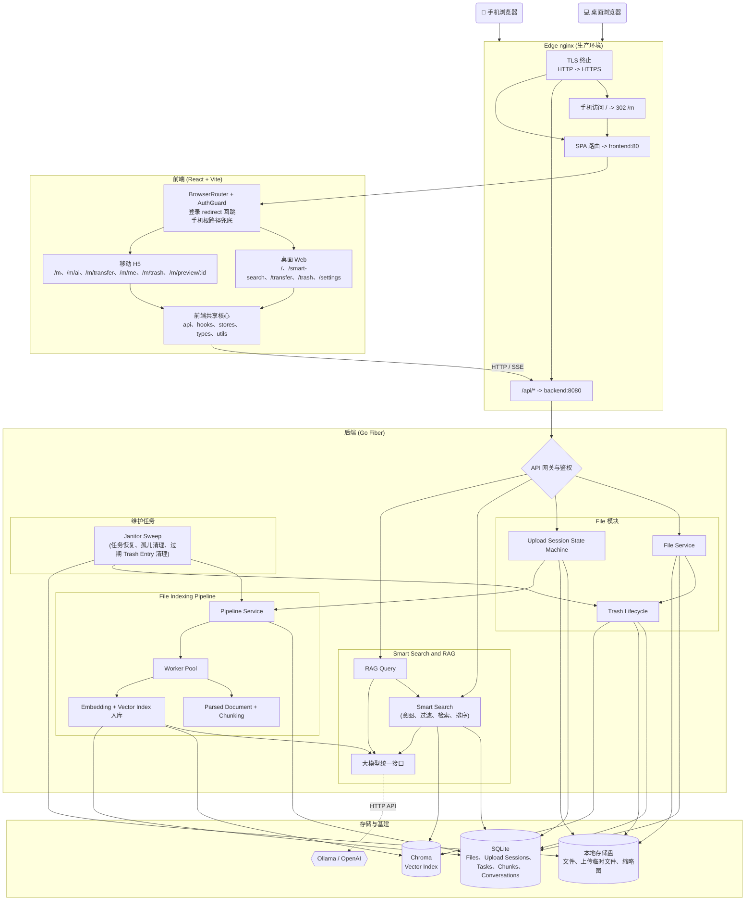

# MemoDrive

MemoDrive 是一个私有的、单用户的智能云盘。通过结合个人网盘的本地存储方案，并利用主流的大模型能力，在存储文件时，可根据文件类型，自动对文件进行 AI 处理，提取文件内容，构建向量索引，实现在 AI 时代下的网盘体验。

[English](./README.md) | 中文

## 当前已实现功能

- 单用户鉴权系统：通过 `ADMIN_PASSWORD` 控制，密码为空则无需登录即可访问。
- 可配置的存储选项：支持自定义存储根目录、SQLite 数据库路径、上传临时目录以及缩略图目录。
- 文件管理核心：文件列表、创建文件夹、重命名/移动 API、回收站软删/还原/永久删除，以及支持 HTTP Range 的断点下载。
- 大文件分片上传：支持显式 Upload Session 状态、上传会话记录、断点续传、完成后自动合并，以及真实传输页进度、暂停/继续、取消和历史清理。
- 异步 File Indexing Pipeline：文件上传后创建持久 Pipeline Task，进入有界 Worker Pool，支持启动恢复、panic 失败标记和优雅关闭。
- 媒体元信息提取：支持图片尺寸提取、JPEG EXIF 解析及缩略图生成。
- 音视频元信息提取：环境支持时自动调用 `ffprobe` 提取时长等元信息。
- 媒体文本入库：图片 OCR 默认开启并在安装 Tesseract 时自动提取文字；音频/视频转录可选接入 whisper.cpp 或 OpenAI 兼容 Whisper 接口。
- Janitor Sweep 鲁棒性：支持启动期恢复中断 Pipeline Task、失败化卡住任务、清理过期 Trash Entry，并周期清理孤儿缩略图。
- 文档解析与智能切片：支持 PDF、DOCX、Markdown、纯文本解析，并按章节/段落进行滑动窗口切片。
- 大模型基础能力：支持 OpenAI 兼容接口与 Ollama Provider，并可根据 `OPENAI_API_KEY` 自动降级。
- 向量库基础能力：支持 ChromaDB collection 管理、向量入库、检索与删除。
- 现代化前端界面：基于 React 开发，桌面 Web 与移动 H5 拆成两套独立页面和样式，共享 API 客户端、hooks、stores、types、上传逻辑、AI 流式和预览渲染能力。
- 桌面 Web 路由：包含 Drive、智能搜索、传输、回收站和设置页。
- 移动 H5 入口：`/m/*` 下提供移动文件页、全屏 AI、传输、我的、回收站、全屏预览、底部导航、URL 化文件夹路径、右下角上传 FAB、移动端轻提示输入/确认，以及默认关闭的可选语义搜索。
- 智能搜索独立页：3 栏布局、常驻 AI 助手、历史会话抽屉，支持流式问答与语义检索切换。
- AI 会话持久化：自动落库 `conversations` / `messages`，支持历史会话列表、切换、重命名与删除。
- RAG 检索质量增强：多轮 query 改写、heading-aware 索引、动态分数过滤、多 query 扩展、关键词/向量混合检索与父子 chunk。
- 生产环境 `edge` nginx：负责 TLS 终止、`/api/` 单跳转发，以及手机访问裸域名 `/` 时临时跳转到 `/m`；前端也提供同规则兜底，保证登录回跳目标正确。
- Docker 全栈部署：提供针对 edge nginx、前端、后端、Chroma 向量数据库及 Ollama 的 Docker Compose 一键启动方案。

## 系统架构

MemoDrive 的实现围绕稳定的产品词汇组织。HTTP 入口保持简洁，上传、索引、搜索、
回收站和 Drive 工作流的顺序细节由更深的内部模块承载。



### 架构模块

- **Upload Session State Machine**：断点续传会话使用明确后端状态（`uploading`、`merging`、`done`、`cancelled`、`expired`、`failed`），前端传输列表只是这些状态的投影，不再维护第二套状态模型。
- **File Indexing Pipeline**：上传完成后的 File 会创建持久 Pipeline Task，并进入有界 Worker Pool。解析、切片、Embedding、元数据更新、Vector Index 入库、panic 兜底、启动恢复和优雅关闭都封装在 Pipeline 接口后。
- **Smart Search and RAG**：意图解析、File 过滤、多 query 扩展、关键词/向量混合检索、父子 Chunk 还原、分数过滤和 RAG 证据组装拆成聚焦的内部模块，对调用方仍保持简洁的 Search / RAG 接口。
- **Trash Lifecycle**：软删除、恢复、永久删除、子项处理、Chunk 清理、Vector Index 清理、物理存储清理，以及 Janitor Sweep 的过期 Trash Entry 清理，都集中在一个生命周期实现中。
- **Drive Workflow**：Drive 页面中的路径、搜索、选择、重命名、删除、移动、创建 Folder、上传、预览和文件展示规则已拆成有测试的 workflow helper，页面负责组合 UI 和副作用。
- **Mobile H5 Surface**：移动端路由集中在 `frontend/src/mobile`，用独立页面和 CSS 处理手机端体验。它复用桌面端稳定业务逻辑，但导航、布局、轻提示、AI 工作台、上传入口和预览外壳都按移动端单独设计。
- **Production Edge Routing**：`edge` nginx 负责 TLS 终止、`/api/*` 直连后端、SPA 路由转发到前端，并在手机 User-Agent 访问裸 `/` 时用临时 `302` 跳转到 `/m`。

### 架构词汇

- **File**：带元数据、虚拟路径和物理存储路径的用户文件对象。
- **Folder**：用于组织 File 的虚拟路径条目。
- **Upload Session**：一个 File 注册入库前的断点续传记录。
- **Pipeline Task**：一个 File 进入 AI 处理流程时生成的持久任务记录。
- **File Indexing Pipeline**：把 File 转换为元数据、Chunk、Embedding 和 Vector Index 条目的流程。
- **Parsed Document**：File 被切分前提取出的文本和结构。
- **Parent Chunk / Child Chunk**：用于恢复上下文的大 Chunk，以及用于检索的小 Chunk。
- **Vector Index**：存放 Chunk Embedding 的外部可检索索引。
- **Smart Search**：组合意图解析、语义检索、关键词检索、过滤和排序的检索工作流。
- **RAG Query**：用检索到的 File 证据和大模型回答的用户问题。
- **Trash Entry**：已软删除、可恢复或永久删除的 File。
- **Janitor Sweep**：周期维护流程，用于恢复 Pipeline Task、清理孤儿存储/缩略图和过期 Trash Entry。
- **Mobile H5 Entry**：`/m/*` 下的手机优先 SPA 入口；它不是桌面 UI 的响应式压缩版。
- **Edge nginx**：生产环境 HTTPS 与路由前门，负责 `/api/*` 代理、SPA 转发和手机访问 `/` 时进入 `/m`。

### 架构优化优先级

1. **Pipeline Worker and File Indexing Pipeline**：把并发、恢复、panic 失败标记和优雅关闭收进一个 Pipeline 接口。
2. **Upload Session State Machine**：让上传状态在后端、HTTP 行为和前端状态投影中保持显式一致。
3. **Smart Search and RAG Depth**：调用接口保持简洁，内部模块分别处理查询理解、检索规划、证据检索和排序。
4. **File, Trash, and Drive Workflow**：集中 Trash 生命周期规则，并按用户意图拆分 Drive 页面行为，避免过早增加公开接口。

## 前端路由入口

桌面端和移动端共享后端 API 与业务 helper，但路由和 UI surface 是刻意分开的。

| 入口 | 路由 | 说明 |
|------|------|------|
| 桌面 Web | `/`、`/smart-search`、`/transfer`、`/trash`、`/settings` | 重生产力入口，保留桌面布局、表格/列表控制、常驻 AI 助手和设置页。 |
| 移动 H5 | `/m`、`/m/ai`、`/m/transfer`、`/m/me`、`/m/trash`、`/m/preview/:fileId` | 手机优先入口，包含底部导航、全屏 AI/预览、固定上传 FAB、移动端轻提示，以及 URL 化文件夹路径。 |
| 鉴权 | `/login` | `AuthGuard` 会把未登录用户带到 `/login?redirect=...`，登录成功后回到原始桌面或移动目标。 |
| API | `/api/*` | 生产环境 edge nginx 将 API 流量直接转发到 `backend:8080`；前端开发服务器把 `/api` 代理到本地后端。 |

移动端入口以显式路由为主：用户始终可以直接打开 `/m/*`，桌面与移动深链也保持分离。生产环境 edge nginx 只对手机访问裸根路径做跳转；React 侧也镜像这一条“仅根路径”的规则，避免代理直接把 `/` 打到前端时登录回跳到桌面根路径：

```text
手机：  https://drive.example.com/ -> 302 /m
平板：  https://drive.example.com/ -> 桌面根路径
任意：  /m/*、/login、/api/* 和其它深链均保持原路径
```

## 项目骨架结构

```text
MemoDrive/
├── frontend/                 # React + Vite + TailwindCSS 前端代码
│   ├── src/
│   │   ├── api/              # API 客户端封装 (auth, files, ai, upload)
│   │   ├── components/       # UI 组件库 (文件管理, AI 助手, 文件预览)
│   │   ├── components/auth/  # AuthGuard 与安全登录 redirect helper
│   │   ├── hooks/            # 自定义 React Hooks (AI 对话, 分片上传)
│   │   ├── layouts/          # 页面布局结构 (MainLayout)
│   │   ├── mobile/           # 独立移动 H5 路由、页面、CSS 和测试
│   │   ├── pages/            # 页面与 workflow helpers (Drive, SmartSearch, Login)
│   │   ├── stores/           # Zustand 全局状态管理
│   │   └── types/            # TypeScript 类型定义
│   ├── index.html            # Vite 入口 HTML 文件
│   └── nginx.conf            # 生产环境 Nginx 反向代理配置
│
├── backend/                  # Go + Fiber 后端代码
│   ├── cmd/server/           # 应用程序启动入口
│   ├── internal/
│   │   ├── config/           # 环境变量解析与全局配置管理
│   │   ├── handler/          # HTTP 路由处理 (鉴权, 文件, 上传, AI, 任务, 健康检查)
│   │   ├── llm/              # 大模型服务接口对接 (Ollama, OpenAI)
│   │   ├── middleware/       # Fiber 中间件 (JWT鉴权, CORS跨域, 接口限流)
│   │   ├── model/            # 数据库结构与对象模型
│   │   ├── parser/           # 文档与媒体解析器, OCR提取, 文本切片
│   │   ├── service/          # 深模块实现 (文件, 上传, Pipeline, Trash, RAG, 搜索)
│   │   ├── store/            # SQLite 数据库持久化层操作
│   │   ├── vectordb/         # 向量数据库客户端交互 (Chroma)
│   │   └── worker/           # 异步任务处理线程池
│   ├── data/                 # 本地数据持久化目录 (含 DB, 文件, 不进 git 追踪)
│   └── Dockerfile            # 后端 Docker 构建配置
│
├── docker-compose.yml        # Docker Compose 核心服务编排文件
├── docker-compose.prod.yml   # Docker Compose 生产环境配置覆写
├── docker-compose.tailnet.yml # 可选的 Tailscale Tailnet 前端入口覆写
├── deploy/nginx/tls.conf     # Edge nginx TLS、API 路由、SPA 转发、移动根路径跳转
├── .env.example              # 环境变量配置模板文件
├── start.sh                  # macOS/Linux 一键启动脚本
└── start.ps1                 # Windows PowerShell 一键启动脚本
```

## 快速启动

我们提供了一个 `Makefile` 来统一管理多端部署与构建。查看所有可用命令：

```bash
make help
```

**1. 准备环境变量**

```bash
cp .env.example .env
```

打开 `.env`，至少设置以下变量：

| 变量 | 说明 |
|------|------|
| `ADMIN_PASSWORD` | 登录密码。留空则关闭鉴权（生产环境不推荐）。 |
| `JWT_SECRET` | JWT 签名密钥。**生产环境必须修改**，可用以下命令生成：`openssl rand -hex 32` |
| `OPENAI_API_KEY` | （可选）OpenAI 兼容 API Key。未设置时自动降级到本地 Ollama。 |

**2. 预建数据目录**（使用 `start.sh` 时自动完成，手动启动时需执行）

```bash
mkdir -p data/files data/db data/tmp data/thumbnails data/chroma data/ollama
```

**3. 一键启动（基于 Docker）**

```bash
make docker-up
```

或使用自动完成第 1~3 步的启动脚本：

```bash
# macOS / Linux
./start.sh

# Windows (PowerShell)
.\start.ps1
```

启动完成后，请在浏览器中打开：

| 入口 | URL |
|------|-----|
| 桌面 Web | `http://localhost:3000` |
| 移动 H5 | `http://localhost:3000/m` |

> **安全提示：** 若 `JWT_SECRET` 仍为默认值或 `ADMIN_PASSWORD` 为空，后端启动时会输出警告日志，可用 `docker compose logs backend` 查看。

## 生产环境 HTTPS（反向代理终止 TLS）

生产环境建议使用 compose 覆盖配置，让公网流量通过 `edge` nginx 以 HTTPS 入口访问：

```bash
docker compose -f docker-compose.yml -f docker-compose.prod.yml up -d --build
```

生产部署的边界设计：
- 新增 `edge` nginx 容器，在 `80`/`443` 上终止 TLS
- `/api/` 请求直接代理到 `backend:8080`（单跳，支持 SSE 流式响应）
- 其余请求代理到 `frontend:80`
- 手机 User-Agent 访问裸根路径 `/` 时，以 `302` 临时跳转到 `/m`；平板 User-Agent 和所有深链不受影响
- 移动端登录通过 `/login?redirect=...` 保持闭环，即使首次 `/` 请求直接到达前端，未登录手机用户登录后也会回到 `/m`
- 云服务器防火墙/安全组应只向公网开放 `80/tcp` 与 `443/tcp`；不要向公网开放 `3000/tcp`、`8080/tcp`、`8000/tcp`、`11434/tcp`。

**部署检查清单：**

1. **在 `.env` 设置强密钥：**
   ```bash
   JWT_SECRET=$(openssl rand -hex 32)
   ADMIN_PASSWORD=your-strong-password
   ```

2. **准备 TLS 证书，并在 `.env` 设置路径：**
   ```
   TLS_CERT_PATH=/path/to/fullchain.pem
   TLS_CERT_KEY_PATH=/path/to/privkey.pem
   ```

3. **确认 API 地址配置**（若 `VITE_API_BASE_URL` 已为 `/api` 则无需修改）：
   ```
   VITE_API_BASE_URL=/api
   ```
   > 前端与 API 同域时，`/api` 始终有效。仅在前后端跨域部署时才需写完整 URL。

4. **验证部署：**
   ```bash
   ./deploy/scripts/verify_tls_login.sh your-domain [your-password]
   ```
   脚本检查：HTTP→HTTPS 跳转、TLS 证书、HSTS 响应头、登录接口可用性。

   可选的移动入口冒烟检查：
   ```bash
   curl -I -A "Mozilla/5.0 (iPhone; CPU iPhone OS 17_0 like Mac OS X) Mobile" https://your-domain/
   ```
   期望结果：`302` 且 `Location: /m`。

5. **端口暴露对比：**

   | 服务 | 开发环境 | 生产环境 |
   |------|---------|---------|
   | Frontend | `3000`（宿主机） | 通过 edge 访问，不应直接对公网开放 |
   | Backend | `8080`（宿主机） | 应用内部服务，阻断公网入站 |
   | Chroma | `8000`（宿主机） | 应用内部服务，阻断公网入站 |
   | Ollama | `11434`（宿主机） | 应用内部服务，阻断公网入站 |
   | Edge nginx | — | 公网 `80`、`443` |

### Tailscale Tailnet 私网加速入口

当云服务器和手机都已加入同一个 Tailnet 时，可以新增一个私有高速入口，不替代原有公网 HTTPS 域名：

```bash
make docker-tailnet-build
```

Tailnet 覆写会把 frontend 的宿主机端口替换成仅本机回环可访问的 Tailscale Serve upstream：

```bash
sudo tailscale set --hostname=memodrive
tailscale serve --bg --https=443 http://127.0.0.1:${TAILSCALE_FRONTEND_PORT:-3000}
```

然后在手机端打开移动入口：

```text
https://memodrive.<your-tailnet>.ts.net/m
```

推荐的 Tailnet 边界：

- 开启 Tailscale MagicDNS 和 HTTPS Certificates。
- 使用 `tailscale serve`，不要使用 `tailscale funnel`；Tailnet 入口应保持私有。
- 在 Tailscale Admin Console 中把 `memodrive` 服务限制为仅你的个人设备可访问。
- 保留 MemoDrive 自己的密码/JWT 登录。公网域名和 Tailnet 域名的浏览器存储相互隔离，因此两边各登录一次是正常现象。
- 云服务器防火墙/安全组向公网开放 `80/tcp`、`443/tcp`，并放行 Tailscale `41641/udp`；阻断公网 `3000/tcp`、`8080/tcp`、`8000/tcp`、`11434/tcp`。

大文件传输慢或失败时，先确认手机打开的是 `https://memodrive.<your-tailnet>.ts.net/m`，再检查 Tailscale 是否直连：

```bash
tailscale status
tailscale ping <phone-device-name>
```

如果连接回落到 DERP 中继，优先检查云服务器防火墙/安全组是否放行 `41641/udp`，再考虑调整 MemoDrive 的 `UPLOAD_CHUNK_SIZE` 等上传参数。

## 本地开发

通过 Makefile 分别启动前后端开发服务器：

```bash
# 终端 1：启动后端服务端 (端口 8080)
make dev-backend

# 终端 2：启动前端开发环境 (端口 3000)
make dev-frontend
```

## 构建与测试

```bash
# 构建前后端全量包
make build-all

# 后端交叉编译（跨平台打包）
make build-linux
make build-windows
make build-mac

# 运行单元测试
make test

# 直接运行后端测试
cd backend && go test ./...

# 运行前端 workflow 测试与 TypeScript 检查
cd frontend && pnpm test
cd frontend && pnpm typecheck
cd frontend && pnpm build
```

## 核心功能里程碑

- `[✓]` **优先级 1: 向量库与大模型基础集成 (VectorDB & LLM)**
    - `[✓]` 实现 `internal/vectordb/chroma.go`，包含 collection 管理、`Upsert`（入库）、`Query`（检索）和 `Delete`（删除）方法
    - `[✓]` 实现 `internal/llm/ollama.go`，接入本地 Ollama 的 Embedding 和流式 Chat 接口
    - `[✓]` 实现 `internal/llm/openai.go`，兼容 OpenAI 规范的 Embedding 和流式 Chat 接口
    - `[✓]` 完善 `internal/llm/provider.go`，优先使用 OpenAI 兼容接口并自动降级到 Ollama
- `[✓]` **优先级 2: 文档解析与智能切片 (Parser & Splitter)**
    - `[✓]` 引入 `github.com/ledongthuc/pdf`，完善 `internal/parser/pdf.go` 的 PDF 纯文本提取、页数上限与文本清洗逻辑
    - `[✓]` 通过轻量 ZIP/XML 方案实现 DOCX 文本提取，并增强 Markdown 与纯文本解析
    - `[✓]` 实现 `internal/parser/splitter.go`，提供滑动窗口、overlap、章节感知与中英文标点感知切片策略
    - `[✓]` 完善 `internal/parser/parser.go` 进行文件类型自动路由与不支持格式处理
- `[✓]` **优先级 3: 核心 AI Pipeline 串联 (Pipeline Service)**
    - `[✓]` 补充 `internal/service/pipeline_service.go` 的文档处理流程：解析文本 -> 文本切片 -> 批量 Embedding -> 存入 ChromaDB
    - `[✓]` 增加 `PIPELINE_EMBED_BATCH_SIZE` 批次配置，Embedding 批次失败自动重试一次
    - `[✓]` 更新文件和任务的进度状态 (UpdateTask Progress)
    - `[✓]` 删除文件时 best-effort 清理 ChromaDB 中对应的向量数据
- `[✓]` **优先级 4: RAG 与语义搜索后端服务 (RAG & Search)**
    - `[✓]` 实现 `internal/service/rag_service.go`：问题向量化 -> Chroma 检索相似片段 -> 组装 Prompt -> 调用 LLM 进行流式回复 (SSE)
    - `[✓]` 实现 `internal/service/search_service.go`：支持纯语义文本搜索，返回带文件引用信息的来源片段列表
- `[✓]` **优先级 5: 前端 AI 助手交互与 SSE 对接 (Frontend AI Assistant)**
    - `[✓]` 完善 `frontend/src/hooks/useAIChat.ts`，解析后端的 Server-Sent Events (SSE) 数据流，实现打字机效果
    - `[✓]` 完善 `frontend/src/components/AIAssistant/AIFloatyBall.tsx` 及其子组件 `ChatMessage.tsx`（支持 Markdown 渲染）
    - `[✓]` 完善 `SourceReference.tsx` 引用来源卡片的交互和跳转逻辑
- `[✓]` **优先级 6: 前端文件在线预览组件 (Frontend File Preview)**
    - `[✓]` 接入 `react-pdf` 完善 `PdfViewer.tsx` 在线预览能力
    - `[✓]` 完善 `ImageViewer.tsx` 的全尺寸图片查看和 EXIF 元信息展示面板
    - `[✓]` 完善 `VideoPlayer.tsx`、`AudioPlayer.tsx` 和 `CodeViewer.tsx` 的预览能力
- `[✓]` **优先级 7: 图片/OCR 等进阶增强 (OCR & Edge Cases)**
    - `[✓]` 实现基于 Tesseract 的图片 OCR，并复用 Pipeline 的 chunk -> embed -> Chroma 入库链路
    - `[✓]` 增加可选音频转录与视频音轨/关键帧文本提取，依赖缺失时安全降级
    - `[✓]` 增加启动期任务恢复、卡住任务清理、孤儿缩略图清理，以及文件/任务状态常量
- `[✓]` **优先级 8: 文件搜索（按文件名 / 内容 / EXIF 混合）**
    - `[✓]` 后端 `POST /api/files/search`：name LIKE + meta_json LIKE + 可选语义合并
    - `[✓]` 前端 DrivePage 顶部搜索框接通后端，结果列表带 `match_types` badge，可选"包含语义搜索"开关
- `[✓]` **优先级 9: 文件 / 目录 移动 + 重命名**
    - `[✓]` 修复目录重命名 / 移动后子节点 `path` 不更新的隐藏 bug（递归改写 + 同名冲突 409 + 自移子路径 409）
    - `[✓]` 前端 FileList 操作菜单加 `重命名 / 移动到… / 下载`，新增 RenameModal 与 MoveDialog
- `[✓]` **优先级 10: 回收站（软删 / 还原 / 永久删除 / 自动到期清理）**
    - `[✓]` schema 引入 `schema_migrations` 幂等迁移，`files` 增 `deleted_at / original_path / original_name`
    - `[✓]` 后端 `/api/trash/*`（list / restore / purge / empty）+ Janitor `SweepTrash` 自动到期清理
    - `[✓]` 前端 TrashPage 完整实现，Drive 删除文案改为"移到回收站"
- `[✓]` **优先级 11: 智能搜索独立页 + 会话历史持久化**
    - `[✓]` `conversations` / `messages` 表激活，RAG / Search 自动落库；SSE 新增 `event: conversation` 推送会话 ID
    - `[✓]` 后端 `/api/conversations/*`（list / get / patch / delete），不暴露 POST 创建
    - `[✓]` 前端 `/smart-search` 独立页：3 栏布局、浮窗自动隐藏、常驻 AssistantPane、ConversationDrawer 历史抽屉
- `[✓]` **优先级 12: 检索准确性增强 (RAG Quality)**
    - `[✓]` **12-A** 多轮检索感知：LLM 重写 query 后再检索，解决“它/那个/上面提到的”等指代问题
    - `[✓]` **12-B** Heading 注入：索引时向 chunk 文本注入段落标题，提升标题类查询命中率
    - `[✓]` **12-C** 动态分数过滤：输出 score distribution 日志，并支持 `RAG_SCORE_PERCENTILE` 百分位裁剪
    - `[✓]` **12-D** 多 query 扩展：LLM 生成 2-3 个替代 query，结果去重合并
    - `[✓]` **12-E** 混合检索：SQLite FTS5/BM25 优先，环境不支持 FTS5 时降级 LIKE，再与 Chroma 向量结果做 RRF 融合
    - `[✓]` **12-F** 父子 chunking：小 chunk 用于检索，大 chunk 用于 LLM 上下文
- `[✓]` **优先级 13: 传输管理增强 (Transfer Management)**
    - `[✓]` **13-A** 上传实时进度展示：`useChunkedUpload` chunk 级进度接入 Transfer 页，新建 `transferStore` 替换 mock 数据
    - `[✓]` **13-B** 取消上传：后端新增 `DELETE /upload/:id` 取消 session 并清理临时文件；前端 `AbortController` 中断传输
    - `[✓]` **13-C** 暂停 / 断点续传：后端新增 `GET /upload/:id` 查询 session 状态；前端暂停循环 + localStorage 持久化 session 信息
    - `[✓]` **13-D** 上传记录管理：后端新增 session 列表/单条删除/批量清除接口；前端 Transfer 页支持单条清除和全部清除
- `[✓]` **优先级 14: 自然语言意图搜索 (NL Intent Search)**
    - `[✓]` **14-A** 意图解析器：规则 + LLM 两级解析，从自然语言中提取时间范围、文件类型、纯文本关键词
    - `[✓]` **14-B** 存储层过滤扩展：`FileSearchFilter` 增加 `DateFrom/DateTo`，新增 `ListFileIDsByFilter` 按日期和类型预查 file_id 列表
    - `[✓]` **14-C** 搜索服务层集成：智能搜索和文件搜索入口插入意图解析，结构化条件转为 SQL 预过滤 + 向量检索组合
    - `[✓]` **14-D** 前端适配：搜索结果展示解析出的筛选条件 Chips，`SearchResponse` 增加 `intent` 字段
- `[✓]` **优先级 15: 移动 H5 入口**
    - `[✓]` 在 `frontend/src/mobile` 下新增独立 `/m/*` 路由，桌面路由保持不变
    - `[✓]` 实现移动文件、AI、传输、我的、回收站、全屏预览页面，并补充移动端 CSS 与布局契约测试
    - `[✓]` 实现文件页上传 FAB、URL 化文件夹路径、移动文件卡片、当前目录搜索、可选语义搜索、轻提示确认/输入以及单文件操作
    - `[✓]` 实现全屏移动 AI：底部输入框固定、内容区滚动、RAG/Search 模式切换与停止流式输出
    - `[✓]` 移动传输、我的、回收站接入共享上传会话、存储、语言、退出登录与回收站 API
    - `[✓]` 生产环境 edge nginx 增加手机访问 `/` 自动进入 `/m`，并完善 Login/AuthGuard 的 redirect 回跳闭环

## 许可证

本项目基于 [MIT License](./LICENSE) 开源。
