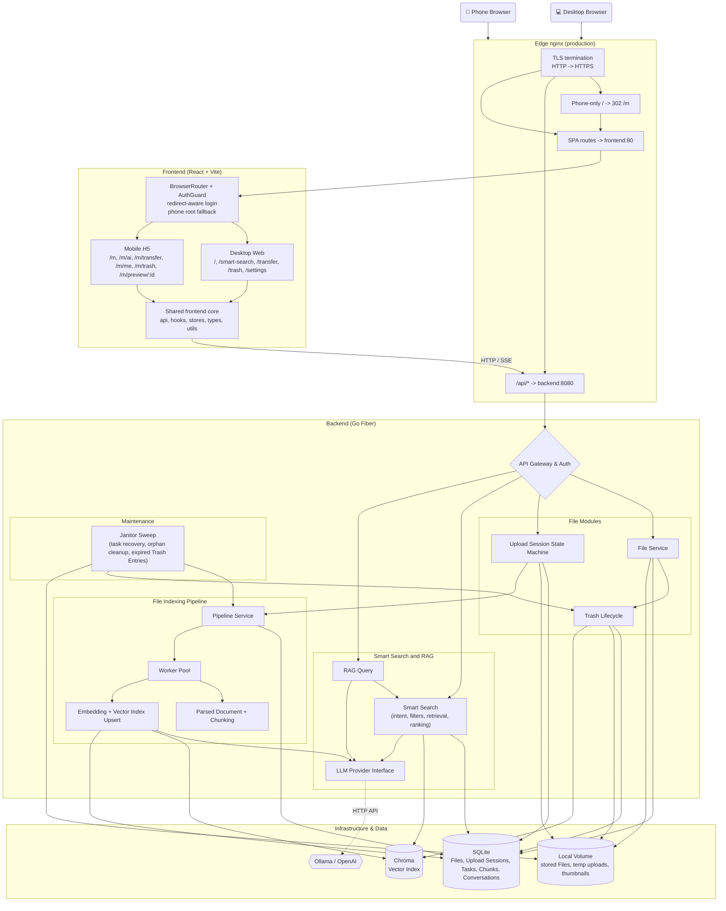

# MemoDrive

MemoDrive is a private, single-user cloud drive with AI capabilities. By combining local storage solutions and utilizing mainstream large model capabilities, it can automatically process files based on the files type when storing them, extracting file content and building vector indexes to create a cloud drive experience in the AI era.

English | [中文](./README-ZH.md)

## What Works Now

- Single-user auth with `ADMIN_PASSWORD`; empty password means no login required.
- Configurable storage root, SQLite database path, upload temp path, and thumbnail path.
- File listing, folder creation, rename/move API, Trash soft-delete/restore/purge, and download with HTTP Range support.
- Chunked upload with explicit Upload Session states, resumable session records, merge-on-complete, and a real Transfer page for progress, pause/resume, cancel, and history cleanup.
- Async File Indexing Pipeline with durable Pipeline Tasks, bounded worker concurrency, startup recovery, panic failure marking, and graceful shutdown.
- Image metadata extraction with dimensions, JPEG EXIF, and thumbnail generation.
- Video/audio metadata extraction through `ffprobe` when available.
- Media text indexing: image OCR is enabled by default via Tesseract when available; audio/video transcription is optional via whisper.cpp or OpenAI-compatible Whisper APIs.
- Janitor Sweep resilience: interrupted Pipeline Task recovery, stuck-task failure marking, expired Trash Entry purging, and periodic orphan thumbnail cleanup.
- PDF, DOCX, Markdown, and plain-text parsing with section-aware smart chunking.
- OpenAI-compatible and Ollama LLM providers with automatic fallback.
- ChromaDB REST client for collection management, vector upsert, query, and delete.
- React frontend with separate desktop and mobile H5 surfaces sharing API clients, hooks, stores, types, upload logic, AI streaming, and preview renderers.
- Desktop Web routes for Drive, Smart Search, Transfer, Trash, and Settings.
- Mobile H5 entry under `/m/*` with mobile Files, full-screen AI, Transfer, Me, Trash, full-screen Preview, bottom navigation, URL-backed Folder paths, fixed upload FAB, lightweight mobile prompts, and current-folder search with semantic search opt-in.
- Standalone smart search page with a docked AI assistant, semantic result list, and conversation history drawer.
- AI conversation persistence backed by `conversations` / `messages`, including history list, switching, rename, and delete APIs.
- RAG quality upgrades: query condense, heading-aware indexing, dynamic score filtering, multi-query expansion, hybrid keyword/vector retrieval, and parent-child chunks.
- Production `edge` nginx for TLS termination, direct `/api/` routing, and phone-only bare-domain redirect from `/` to `/m`, with a matching frontend fallback for login return targets.
- Docker Compose stack for edge nginx, frontend, backend, Chroma, and Ollama.

## Architecture

MemoDrive's implementation is organized around stable product vocabulary. The
HTTP surface stays small, while deeper internal modules hide sequencing details
for uploads, indexing, search, trash, and Drive workflows.



### Architectural Modules

- **Upload Session State Machine**: resumable upload sessions move through explicit backend statuses (`uploading`, `merging`, `done`, `cancelled`, `expired`, `failed`), and the frontend transfer store projects those statuses instead of inventing a second state model.
- **File Indexing Pipeline**: uploaded Files enqueue durable Pipeline Tasks into a bounded Worker Pool. Parsing, chunking, embedding, metadata updates, vector upserts, panic handling, recovery, and graceful shutdown are kept behind the Pipeline interface.
- **Smart Search and RAG**: intent parsing, file filtering, multi-query expansion, hybrid keyword/vector retrieval, parent-child Chunk restoration, score filtering, and RAG evidence assembly are split into focused internal modules while callers still use compact Search and RAG APIs.
- **Trash Lifecycle**: soft delete, restore, permanent purge, descendant handling, Chunk cleanup, Vector Index cleanup, physical storage cleanup, and Janitor Sweep purging are concentrated in one lifecycle implementation.
- **Drive Workflow**: Drive page path, search, selection, rename, delete, move, create-Folder, upload, preview, and file-presentation rules are split into tested workflow helpers, leaving the page to compose UI and side effects.
- **Mobile H5 Surface**: mobile routes live under `frontend/src/mobile` and use independent pages/CSS for phone ergonomics. They share stable business logic with desktop but keep layout, navigation, prompts, AI workspace, upload entry, and preview shells mobile-specific.
- **Production Edge Routing**: the `edge` nginx terminates TLS, sends `/api/*` directly to the backend, serves all SPA routes through the frontend, and redirects phone User-Agents opening the bare `/` path to `/m` with a temporary `302`.

### Architecture Vocabulary

- **File**: a stored user item with metadata, a virtual path, and a physical storage path.
- **Folder**: a virtual path entry used to organize Files.
- **Upload Session**: a resumable transfer record before one File is registered.
- **Pipeline Task**: a durable work record for AI processing of one File.
- **File Indexing Pipeline**: the flow that turns a File into metadata, Chunks, embeddings, and Vector Index entries.
- **Parsed Document**: text and structure extracted from a File before chunking.
- **Parent Chunk / Child Chunk**: large context Chunks and smaller retrieval Chunks used by Smart Search and RAG.
- **Vector Index**: the external searchable store of Chunk embeddings.
- **Smart Search**: retrieval that combines intent parsing, semantic search, keyword search, filters, and ranking.
- **RAG Query**: a user question answered with retrieved File evidence and an LLM.
- **Trash Entry**: a soft-deleted File that can be restored or purged.
- **Janitor Sweep**: periodic maintenance for Pipeline Tasks, orphaned storage, thumbnails, and expired Trash Entries.
- **Mobile H5 Entry**: the phone-first SPA surface under `/m/*`; it is not a responsive shrink of the desktop UI.
- **Edge nginx**: production TLS and routing front door; it handles HTTPS, `/api/*` proxying, and phone-only `/` to `/m` entry routing.

### Architecture Optimization Priorities

1. **Pipeline Worker and File Indexing Pipeline**: keep concurrency, recovery, panic failure marking, and shutdown behind one Pipeline interface.
2. **Upload Session State Machine**: make transfer states explicit across backend, HTTP behavior, and frontend projections.
3. **Smart Search and RAG Depth**: keep caller APIs compact while internal modules handle query understanding, retrieval planning, evidence retrieval, and ranking.
4. **File, Trash, and Drive Workflow**: centralize Trash lifecycle rules and split Drive page behavior by user intent without adding unnecessary public seams.

## Frontend Route Surfaces

Desktop and mobile share backend APIs and business helpers, but their routes and UI surfaces are intentionally separate.

| Surface | Routes | Notes |
|---------|--------|-------|
| Desktop Web | `/`, `/smart-search`, `/transfer`, `/trash`, `/settings` | Full productivity surface with desktop layout, table/list controls, docked AI assistant, and settings. |
| Mobile H5 | `/m`, `/m/ai`, `/m/transfer`, `/m/me`, `/m/trash`, `/m/preview/:fileId` | Phone-first surface with bottom navigation, full-screen AI/Preview, fixed upload FAB, mobile prompts, and URL-backed Folder paths. |
| Auth | `/login` | `AuthGuard` redirects unauthenticated users to `/login?redirect=...`; after login the user returns to the original desktop or mobile target. |
| API | `/api/*` | Production edge nginx routes API traffic directly to `backend:8080`; frontend dev server proxies `/api` to the local backend. |

Mobile behavior is route-first: users can always open `/m/*` directly, and desktop/mobile deep links stay separate. In production the edge nginx redirects only the bare root path for phones; the React app also mirrors that root-only rule so Login redirects remain correct if a proxy serves `/` without the edge redirect:

```text
Phone:   https://drive.example.com/ -> 302 /m
Tablet:  https://drive.example.com/ -> desktop root
Any:     /m/*, /login, /api/*, and other deep links stay on their requested paths
```

## Project Structure

```text
MemoDrive/
├── frontend/                 # React + Vite + TailwindCSS Frontend
│   ├── src/
│   │   ├── api/              # API clients for auth, files, ai, and upload
│   │   ├── components/       # UI Components (FileManager, AIAssistant, FilePreview)
│   │   ├── components/auth/  # AuthGuard and safe login redirect helpers
│   │   ├── hooks/            # Custom React hooks (useAIChat, useChunkedUpload)
│   │   ├── layouts/          # Page layouts (MainLayout)
│   │   ├── mobile/           # Standalone Mobile H5 routes, pages, CSS, and tests
│   │   ├── pages/            # Pages and workflow helpers (Drive, SmartSearch, Login)
│   │   ├── stores/           # Zustand state management
│   │   └── types/            # TypeScript interfaces
│   ├── index.html            # Vite entry HTML
│   └── nginx.conf            # Production Nginx configuration
│
├── backend/                  # Go + Fiber Backend
│   ├── cmd/server/           # Application entrypoint
│   ├── internal/
│   │   ├── config/           # Environment configuration management
│   │   ├── handler/          # HTTP handlers (auth, file, upload, ai, task, health)
│   │   ├── llm/              # LLM Provider integrations (Ollama, OpenAI)
│   │   ├── middleware/       # Fiber middlewares (auth, cors, ratelimit)
│   │   ├── model/            # Data models and structures
│   │   ├── parser/           # Document and media parsers, OCR, text splitter
│   │   ├── service/          # Deep modules (file, upload, pipeline, trash, rag, search)
│   │   ├── store/            # SQLite database interactions
│   │   ├── vectordb/         # Vector database client (Chroma)
│   │   └── worker/           # Async task pool
│   ├── data/                 # Local data directory (db, files, etc.)
│   └── Dockerfile            # Backend Docker build file
│
├── docker-compose.yml        # Main Docker compose file for all services
├── docker-compose.prod.yml   # Production Docker compose overrides
├── docker-compose.tailnet.yml # Optional Tailscale Tailnet frontend entrypoint
├── deploy/nginx/tls.conf     # Edge nginx TLS, API routing, SPA proxy, mobile root redirect
├── .env.example              # Example environment variables
├── start.sh                  # macOS/Linux startup script
└── start.ps1                 # Windows startup script
```

## Quick Start

We provide a `Makefile` for unified multi-platform management. To see all available commands:

```bash
make help
```

**1. Copy and edit environment variables**

```bash
cp .env.example .env
```

Open `.env` and set at minimum:

| Variable | Description |
|----------|-------------|
| `ADMIN_PASSWORD` | Login password. Leave empty to disable authentication (not recommended in production). |
| `JWT_SECRET` | Secret key for signing JWTs. **Must be changed** before production deployment. Generate one with: `openssl rand -hex 32` |
| `OPENAI_API_KEY` | (Optional) OpenAI-compatible API key. If unset, falls back to local Ollama. |

**2. Pre-create data directories** (only needed if not using `start.sh`)

```bash
mkdir -p data/files data/db data/tmp data/thumbnails data/chroma data/ollama
```

**3. Start via Docker**

```bash
make docker-up
```

Or use the all-in-one script which handles steps 1–3 automatically:

```bash
# macOS / Linux
./start.sh

# Windows (PowerShell)
.\start.ps1
```

Then open:

| Entry | URL |
|-------|-----|
| Desktop Web | `http://localhost:3000` |
| Mobile H5 | `http://localhost:3000/m` |

> **Security note:** If `JWT_SECRET` is still the default value or `ADMIN_PASSWORD` is empty, the backend will log a warning on startup. Check the logs with `docker compose logs backend`.

## Production HTTPS (TLS Termination at Reverse Proxy)

For production, use the compose override so public traffic enters through the `edge` nginx with HTTPS:

```bash
docker compose -f docker-compose.yml -f docker-compose.prod.yml up -d --build
```

The prod deployment is designed around this boundary:
- Adds an `edge` nginx container that terminates TLS on ports `80`/`443`
- Routes `/api/` directly to `backend:8080` (single-hop, SSE streaming supported)
- Routes everything else to `frontend:80`
- Redirects phone User-Agents opening the bare root path `/` to `/m` with `302`; tablet User-Agents and all deep links are left unchanged
- Keeps mobile login closed-loop through `/login?redirect=...`, so unauthenticated phone users return to `/m` after login even if the first `/` request reached the frontend directly
- Keep your cloud firewall/security group restricted to public `80/tcp` and `443/tcp`; block direct public access to `3000/tcp`, `8080/tcp`, `8000/tcp`, and `11434/tcp`.

**Setup checklist:**

1. **Set strong secrets in `.env`:**
   ```bash
   JWT_SECRET=$(openssl rand -hex 32)
   ADMIN_PASSWORD=your-strong-password
   ```

2. **Place TLS certificates and set paths in `.env`:**
   ```
   TLS_CERT_PATH=/path/to/fullchain.pem
   TLS_CERT_KEY_PATH=/path/to/privkey.pem
   ```

3. **Set the API base URL** (only needed if `VITE_API_BASE_URL` is not already `/api`):
   ```
   VITE_API_BASE_URL=/api
   ```
   > When frontend and API share the same domain via the edge nginx, `/api` always works. Only set a full URL if you're serving frontend and backend from different domains.

4. **Validate the deployment:**
   ```bash
   ./deploy/scripts/verify_tls_login.sh your-domain [your-password]
   ```
   The script checks: HTTP→HTTPS redirect, TLS certificate, HSTS header, and login endpoint.

   Optional mobile-entry smoke check:
   ```bash
   curl -I -A "Mozilla/5.0 (iPhone; CPU iPhone OS 17_0 like Mac OS X) Mobile" https://your-domain/
   ```
   Expected result: `302` with `Location: /m`.

5. **Port exposure summary:**

   | Service | Dev | Production |
   |---------|-----|------------|
   | Frontend | `3000` (host) | behind edge; do not open directly to the public internet |
   | Backend | `8080` (host) | app-internal; block public ingress |
   | Chroma | `8000` (host) | app-internal; block public ingress |
   | Ollama | `11434` (host) | app-internal; block public ingress |
   | Edge nginx | — | public `80`, `443` |

### Tailscale Tailnet Acceleration

If the server and phone are both in the same Tailnet, add a private high-throughput entrypoint without replacing the public HTTPS domain:

```bash
docker compose -f docker-compose.yml -f docker-compose.prod.yml -f docker-compose.tailnet.yml up -d --build
```

The Tailnet override replaces the frontend host binding with a loopback-only upstream for Tailscale Serve:

```bash
sudo tailscale set --hostname=memodrive
tailscale serve --bg --https=443 http://127.0.0.1:${TAILSCALE_FRONTEND_PORT:-3000}
```

Then open the mobile entry from your phone:

```text
https://memodrive.<your-tailnet>.ts.net/m
```

Recommended Tailnet boundary:

- Enable Tailscale MagicDNS and HTTPS certificates.
- Use `tailscale serve`, not `tailscale funnel`; the Tailnet entry should stay private.
- In the Tailscale admin console, limit access to the `memodrive` service to your own devices.
- Keep MemoDrive's normal password/JWT login enabled. The public domain and Tailnet domain have separate browser storage, so expect to log in once on each domain.
- Keep the cloud firewall/security group allowing public `80/tcp`, public `443/tcp`, and Tailscale `41641/udp`; block public `3000/tcp`, `8080/tcp`, `8000/tcp`, and `11434/tcp`.

For slow or failed large transfers, first confirm the phone is using `https://memodrive.<your-tailnet>.ts.net/m`, then check direct connectivity:

```bash
tailscale status
tailscale ping <phone-device-name>
```

If the connection falls back to DERP, check that `41641/udp` is allowed by the cloud firewall/security group before changing MemoDrive upload settings such as `UPLOAD_CHUNK_SIZE`.

## Local Development

Start the backend and frontend separately using make:

```bash
# Terminal 1: Start Backend (Port 8080)
make dev-backend

# Terminal 2: Start Frontend (Port 3000)
make dev-frontend
```

## Build & Test

```bash
# Build backend and frontend
make build-all

# Cross-platform backend build
make build-linux
make build-windows
make build-mac

# Run backend tests
make test

# Run backend tests directly
cd backend && go test ./...

# Run frontend workflow tests and TypeScript checks
cd frontend && pnpm test
cd frontend && pnpm typecheck
cd frontend && pnpm build
```

## Core Feature Milestones

- `[✓]` **Priority 1: Vector Database and LLM Foundation (VectorDB & LLM)**
    - `[✓]` Implement `internal/vectordb/chroma.go` with collection, `Upsert`, `Query`, and `Delete` methods.
    - `[✓]` Implement `internal/llm/ollama.go` for local Ollama Embedding and streaming Chat APIs.
    - `[✓]` Implement `internal/llm/openai.go` for OpenAI-compatible Embedding and streaming Chat APIs.
    - `[✓]` Complete `internal/llm/provider.go` to prefer OpenAI-compatible APIs and automatically fall back to Ollama.
- `[✓]` **Priority 2: Document Parsing and Smart Chunking (Parser & Splitter)**
    - `[✓]` Integrate `github.com/ledongthuc/pdf` for PDF plain-text extraction with page limits and cleanup.
    - `[✓]` Implement lightweight DOCX ZIP/XML extraction and enhanced Markdown/plain-text parsing.
    - `[✓]` Implement `internal/parser/splitter.go` with sliding-window, overlap, section-aware, and punctuation-aware chunking.
    - `[✓]` Complete `internal/parser/parser.go` for automatic file type routing and unsupported-format handling.
- `[✓]` **Priority 3: Core AI Pipeline Integration (Pipeline Service)**
    - `[✓]` Update `internal/service/pipeline_service.go` workflow: parse text -> chunk -> batch embed -> save to ChromaDB.
    - `[✓]` Add `PIPELINE_EMBED_BATCH_SIZE` configuration and retry each failed embedding batch once.
    - `[✓]` Update task and file progress status logic.
    - `[✓]` Clean up corresponding ChromaDB vectors best-effort when files are deleted.
- `[✓]` **Priority 4: RAG and Semantic Search Backend (RAG & Search)**
    - `[✓]` Implement `internal/service/rag_service.go`: vectorize question -> search Chroma -> build Prompt -> stream LLM response via SSE.
    - `[✓]` Implement `internal/service/search_service.go` for semantic search with source references.
- `[✓]` **Priority 5: Frontend AI Assistant and SSE (Frontend AI Assistant)**
    - `[✓]` Complete `frontend/src/hooks/useAIChat.ts` to parse backend SSE streams with a typewriter effect.
    - `[✓]` Complete `frontend/src/components/AIAssistant/AIFloatyBall.tsx` and `ChatMessage.tsx` (with Markdown support).
    - `[✓]` Complete source reference navigation in `SourceReference.tsx`.
- `[✓]` **Priority 6: Frontend Online File Preview (Frontend File Preview)**
    - `[✓]` Integrate `react-pdf` into `PdfViewer.tsx`.
    - `[✓]` Complete full-size image viewing and EXIF metadata panel in `ImageViewer.tsx`.
    - `[✓]` Complete preview components for `VideoPlayer.tsx`, `AudioPlayer.tsx`, and `CodeViewer.tsx`.
- `[✓]` **Priority 7: OCR and Edge Cases (OCR & Edge Cases)**
    - `[✓]` Implement Tesseract-backed image OCR and reuse the Pipeline chunk -> embed -> Chroma upsert flow for media text.
    - `[✓]` Add optional audio transcription and video audio/keyframe text extraction with safe degradation when dependencies are missing.
    - `[✓]` Add startup task recovery, stuck-task cleanup, orphan thumbnail cleanup, and shared file/task status constants.
- `[✓]` **Priority 8: File Search (name + content + EXIF mix)**
    - `[✓]` Backend `POST /api/files/search` blending `files.name` LIKE, `file_metadata.meta_json` LIKE, and optional semantic merge.
    - `[✓]` Frontend DrivePage top search box wired up; result list shows `match_types` badges with an opt-in "include semantic search" toggle.
- `[✓]` **Priority 9: File / Folder Move + Rename**
    - `[✓]` Fix the hidden bug where renaming/moving a folder leaves children's `path` stale (recursive rewrite + 409 on name conflict + 409 on moving a folder into itself).
    - `[✓]` Frontend FileList action menu adds `Rename / Move to... / Download`; new RenameModal and MoveDialog.
- `[✓]` **Priority 10: Trash (soft delete / restore / purge / auto-expire)**
    - `[✓]` Introduce idempotent `schema_migrations`; add `deleted_at / original_path / original_name` columns to `files`.
    - `[✓]` Backend `/api/trash/*` (list / restore / purge / empty) + Janitor `SweepTrash` auto-purge of expired records.
    - `[✓]` Frontend TrashPage full implementation; Drive delete copy becomes "Move to Trash".
- `[✓]` **Priority 11: Standalone Smart Search Page + Conversation History**
    - `[✓]` Activate `conversations` / `messages` tables; auto-log every RAG / Search call; first SSE frame `event: conversation` carries the conversation id.
    - `[✓]` Backend `/api/conversations/*` (list / get / patch / delete); `POST` deliberately not exposed.
    - `[✓]` Frontend `/smart-search` page: 3-column layout, floating ball auto-hidden, docked AssistantPane, ConversationDrawer for history.
- `[✓]` **Priority 12: Retrieval Accuracy Enhancement (RAG Quality)**
    - `[✓]` **12-A** Multi-turn aware retrieval: Query Condense via LLM rewrite before vector search.
    - `[✓]` **12-B** Heading injection into chunk text at indexing time for better semantic coverage.
    - `[✓]` **12-C** MinScore dynamic tuning: score distribution logging + configurable percentile threshold.
    - `[✓]` **12-D** Multi-query expansion: LLM generates 2-3 alternate queries, results merged via deduplication.
    - `[✓]` **12-E** Hybrid retrieval: SQLite FTS5 BM25 on chunk text + Reciprocal Rank Fusion with vector results.
    - `[✓]` **12-F** Parent-child chunking: small chunks for retrieval, parent chunks for LLM context.
- `[✓]` **Priority 13: Transfer Management Enhancement**
    - `[✓]` **13-A** Real-time upload progress: wire `useChunkedUpload` chunk-level progress into Transfer page via `transferStore`, replacing mock data.
    - `[✓]` **13-B** Cancel upload: backend `DELETE /upload/:id` to cancel session and cleanup temp files; frontend `AbortController` to interrupt in-flight chunks.
    - `[✓]` **13-C** Pause / resume upload: backend `GET /upload/:id` to query session state; frontend pause loop + localStorage session persistence for cross-refresh resume.
    - `[✓]` **13-D** Upload record management: backend list/delete/clear session APIs; frontend single-delete and clear-all on Transfer page.
- `[✓]` **Priority 14: NL Intent Search**
    - `[✓]` **14-A** Intent parser: two-tier (regex rules + LLM fallback) extraction of date ranges, file types, and text keywords from natural language queries.
    - `[✓]` **14-B** Storage layer filter extension: add `DateFrom/DateTo` to `FileSearchFilter`; new `ListFileIDsByFilter` for pre-filtering file IDs by date and type.
    - `[✓]` **14-C** Search service integration: insert intent parsing at Search and SearchFiles entry points; convert structured filters into SQL pre-filter + vector search combo.
    - `[✓]` **14-D** Frontend adaptation: display parsed filter Chips in search results; add `intent` field to `SearchResponse`.
- `[✓]` **Priority 15: Mobile H5 Entry**
    - `[✓]` Add independent `/m/*` routes under `frontend/src/mobile`, leaving desktop routes unchanged.
    - `[✓]` Implement mobile Files, AI, Transfer, Me, Trash, and full-screen Preview pages with mobile-specific CSS and layout contracts.
    - `[✓]` Add Files upload FAB, URL-backed Folder paths, mobile file cards, current-folder search, semantic search opt-in, lightweight confirm/text prompts, and single-file actions.
    - `[✓]` Build full-screen mobile AI with fixed bottom composer, scrollable content region, RAG/Search mode switch, and streaming stop behavior.
    - `[✓]` Wire mobile Transfer, Me, and Trash to shared upload/session/trash APIs.
    - `[✓]` Add production edge nginx phone-only `/` to `/m` redirect and redirect-aware Login/AuthGuard flow.

## License

This project is licensed under the [MIT License](./LICENSE).
