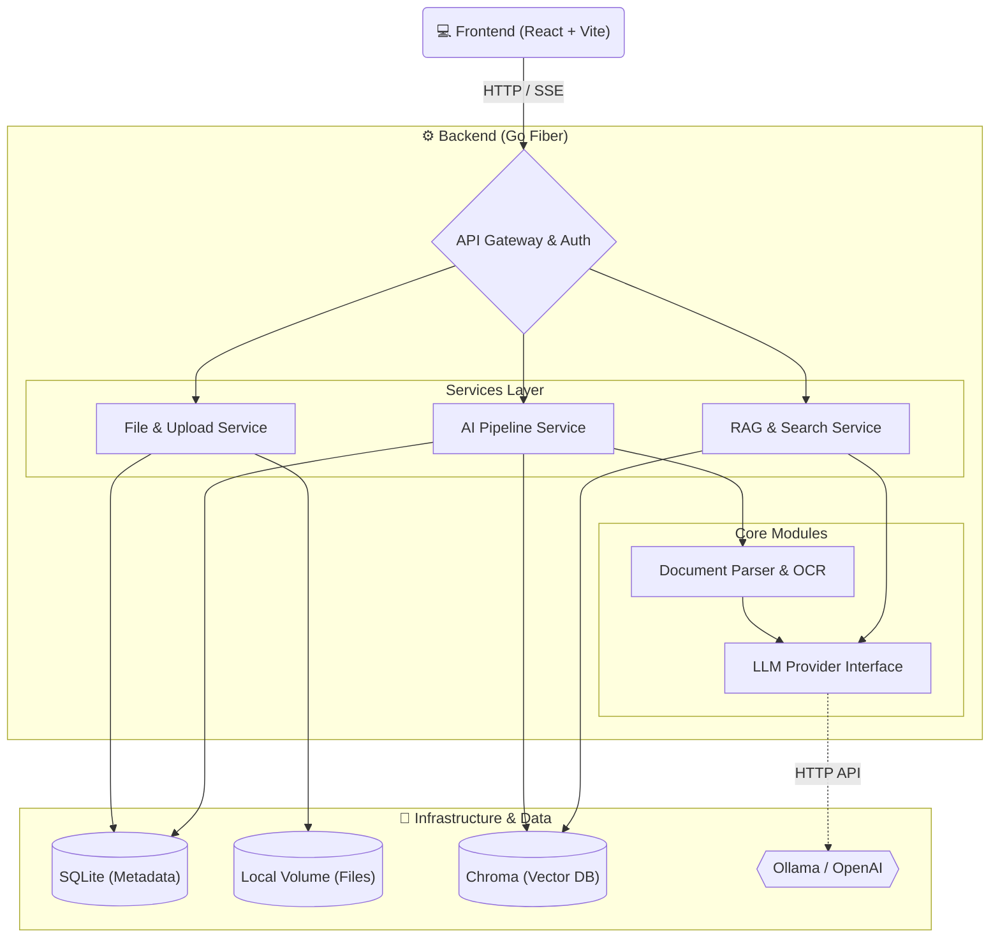

# MemoDrive

MemoDrive is a private, single-user cloud drive with AI capabilities. By combining local storage solutions and utilizing mainstream large model capabilities, it can automatically process files based on the files type when storing them, extracting file content and building vector indexes to create a cloud drive experience in the AI era.

[English](./README.md) | [中文](./README-ZH.md)

## What Works Now

- Single-user auth with `ADMIN_PASSWORD`; empty password means no login required.
- Configurable storage root, SQLite database path, upload temp path, and thumbnail path.
- File listing, folder creation, rename/move API, Trash soft-delete/restore/purge, and download with HTTP Range support.
- Chunked upload with resumable session records, merge-on-complete, and a real Transfer page for progress, pause/resume, cancel, and history cleanup.
- Async Pipeline task creation after upload.
- Image metadata extraction with dimensions, JPEG EXIF, and thumbnail generation.
- Video/audio metadata extraction through `ffprobe` when available.
- Media text indexing: image OCR is enabled by default via Tesseract when available; audio/video transcription is optional via whisper.cpp or OpenAI-compatible Whisper APIs.
- Pipeline resilience: startup recovery for interrupted tasks, stuck-task failure marking, and periodic orphan thumbnail cleanup.
- PDF, DOCX, Markdown, and plain-text parsing with section-aware smart chunking.
- OpenAI-compatible and Ollama LLM providers with automatic fallback.
- ChromaDB REST client for collection management, vector upsert, query, and delete.
- React frontend with login, file manager, upload progress, preview, metadata panel, and streaming AI chat panel.
- Standalone smart search page with a docked AI assistant, semantic result list, and conversation history drawer.
- AI conversation persistence backed by `conversations` / `messages`, including history list, switching, rename, and delete APIs.
- RAG quality upgrades: query condense, heading-aware indexing, dynamic score filtering, multi-query expansion, hybrid keyword/vector retrieval, and parent-child chunks.
- Docker Compose stack for frontend, backend, Chroma, and Ollama.

## Architecture



## Project Structure

```text
MemoDrive/
├── frontend/                 # React + Vite + TailwindCSS Frontend
│   ├── src/
│   │   ├── api/              # API clients for auth, files, ai, and upload
│   │   ├── components/       # UI Components (FileManager, AIAssistant, FilePreview)
│   │   ├── hooks/            # Custom React hooks (useAIChat, useChunkedUpload)
│   │   ├── layouts/          # Page layouts (MainLayout)
│   │   ├── pages/            # Next-level pages (DrivePage, LoginPage)
│   │   ├── stores/           # Zustand state management
│   │   └── types/            # TypeScript interfaces
│   ├── index.html            # Vite entry HTML
│   └── nginx.conf            # Production Nginx configuration
│
├── backend/                  # Go + Fiber Backend
│   ├── cmd/server/           # Application entrypoint
│   ├── internal/
│   │   ├── config/           # Environment configuration management
│   │   ├── handler/          # HTTP handlers (auth, file, upload, ai, task, health)
│   │   ├── llm/              # LLM Provider integrations (Ollama, OpenAI)
│   │   ├── middleware/       # Fiber middlewares (auth, cors, ratelimit)
│   │   ├── model/            # Data models and structures
│   │   ├── parser/           # Document and media parsers, OCR, text splitter
│   │   ├── service/          # Core business logic (file, upload, pipeline, rag, search)
│   │   ├── store/            # SQLite database interactions
│   │   ├── vectordb/         # Vector database client (Chroma)
│   │   └── worker/           # Async task pool
│   ├── data/                 # Local data directory (db, files, etc.)
│   └── Dockerfile            # Backend Docker build file
│
├── docker-compose.yml        # Main Docker compose file for all services
├── docker-compose.prod.yml   # Production Docker compose overrides
├── .env.example              # Example environment variables
├── start.sh                  # macOS/Linux startup script
└── start.ps1                 # Windows startup script
```

## Quick Start

We provide a `Makefile` for unified multi-platform management. To see all available commands:

```bash
make help
```

**1. Copy and edit environment variables**

```bash
cp .env.example .env
```

Open `.env` and set at minimum:

| Variable | Description |
|----------|-------------|
| `ADMIN_PASSWORD` | Login password. Leave empty to disable authentication (not recommended in production). |
| `JWT_SECRET` | Secret key for signing JWTs. **Must be changed** before production deployment. Generate one with: `openssl rand -hex 32` |
| `OPENAI_API_KEY` | (Optional) OpenAI-compatible API key. If unset, falls back to local Ollama. |

**2. Pre-create data directories** (only needed if not using `start.sh`)

```bash
mkdir -p data/files data/db data/tmp data/thumbnails data/chroma data/ollama
```

**3. Start via Docker**

```bash
make docker-up
```

Or use the all-in-one script which handles steps 1–3 automatically:

```bash
# macOS / Linux
./start.sh

# Windows (PowerShell)
.\start.ps1
```

Then open `http://localhost:3000`.

> **Security note:** If `JWT_SECRET` is still the default value or `ADMIN_PASSWORD` is empty, the backend will log a warning on startup. Check the logs with `docker compose logs backend`.

## Production HTTPS (TLS Termination at Reverse Proxy)

For production, use the compose override so all external traffic enters through the `edge` nginx with HTTPS:

```bash
docker compose -f docker-compose.yml -f docker-compose.prod.yml up -d --build
```

The prod override:
- Removes all direct host port bindings from `backend`, `chroma`, and `ollama` (internal only)
- Adds an `edge` nginx container that terminates TLS on ports `80`/`443`
- Routes `/api/` directly to `backend:8080` (single-hop, SSE streaming supported)
- Routes everything else to `frontend:80`

**Setup checklist:**

1. **Set strong secrets in `.env`:**
   ```bash
   JWT_SECRET=$(openssl rand -hex 32)
   ADMIN_PASSWORD=your-strong-password
   ```

2. **Place TLS certificates and set paths in `.env`:**
   ```
   TLS_CERT_PATH=/path/to/fullchain.pem
   TLS_CERT_KEY_PATH=/path/to/privkey.pem
   ```

3. **Set the API base URL** (only needed if `VITE_API_BASE_URL` is not already `/api`):
   ```
   VITE_API_BASE_URL=/api
   ```
   > When frontend and API share the same domain via the edge nginx, `/api` always works. Only set a full URL if you're serving frontend and backend from different domains.

4. **Validate the deployment:**
   ```bash
   ./deploy/scripts/verify_tls_login.sh your-domain [your-password]
   ```
   The script checks: HTTP→HTTPS redirect, TLS certificate, HSTS header, and login endpoint.

5. **Port exposure summary:**

   | Service | Dev | Production |
   |---------|-----|------------|
   | Frontend | `3000` (host) | internal only |
   | Backend | `8080` (host) | internal only |
   | Chroma | `8000` (host) | internal only |
   | Ollama | `11434` (host) | internal only |
   | Edge nginx | — | `80`, `443` (host) |

## Local Development

Start the backend and frontend separately using make:

```bash
# Terminal 1: Start Backend (Port 8080)
make dev-backend

# Terminal 2: Start Frontend (Port 3000)
make dev-frontend
```

## Build & Test

```bash
# Build backend and frontend
make build-all

# Cross-platform backend build
make build-linux
make build-windows
make build-mac

# Run backend tests
make test
```

## Core Unfinished Feature Tasks

- `[✓]` **Priority 1: Vector Database and LLM Foundation (VectorDB & LLM)**
    - `[✓]` Implement `internal/vectordb/chroma.go` with collection, `Upsert`, `Query`, and `Delete` methods.
    - `[✓]` Implement `internal/llm/ollama.go` for local Ollama Embedding and streaming Chat APIs.
    - `[✓]` Implement `internal/llm/openai.go` for OpenAI-compatible Embedding and streaming Chat APIs.
    - `[✓]` Complete `internal/llm/provider.go` to prefer OpenAI-compatible APIs and automatically fall back to Ollama.
- `[✓]` **Priority 2: Document Parsing and Smart Chunking (Parser & Splitter)**
    - `[✓]` Integrate `github.com/ledongthuc/pdf` for PDF plain-text extraction with page limits and cleanup.
    - `[✓]` Implement lightweight DOCX ZIP/XML extraction and enhanced Markdown/plain-text parsing.
    - `[✓]` Implement `internal/parser/splitter.go` with sliding-window, overlap, section-aware, and punctuation-aware chunking.
    - `[✓]` Complete `internal/parser/parser.go` for automatic file type routing and unsupported-format handling.
- `[✓]` **Priority 3: Core AI Pipeline Integration (Pipeline Service)**
    - `[✓]` Update `internal/service/pipeline_service.go` workflow: parse text -> chunk -> batch embed -> save to ChromaDB.
    - `[✓]` Add `PIPELINE_EMBED_BATCH_SIZE` configuration and retry each failed embedding batch once.
    - `[✓]` Update task and file progress status logic.
    - `[✓]` Clean up corresponding ChromaDB vectors best-effort when files are deleted.
- `[✓]` **Priority 4: RAG and Semantic Search Backend (RAG & Search)**
    - `[✓]` Implement `internal/service/rag_service.go`: vectorize question -> search Chroma -> build Prompt -> stream LLM response via SSE.
    - `[✓]` Implement `internal/service/search_service.go` for semantic search with source references.
- `[✓]` **Priority 5: Frontend AI Assistant and SSE (Frontend AI Assistant)**
    - `[✓]` Complete `frontend/src/hooks/useAIChat.ts` to parse backend SSE streams with a typewriter effect.
    - `[✓]` Complete `frontend/src/components/AIAssistant/AIFloatyBall.tsx` and `ChatMessage.tsx` (with Markdown support).
    - `[✓]` Complete source reference navigation in `SourceReference.tsx`.
- `[✓]` **Priority 6: Frontend Online File Preview (Frontend File Preview)**
    - `[✓]` Integrate `react-pdf` into `PdfViewer.tsx`.
    - `[✓]` Complete full-size image viewing and EXIF metadata panel in `ImageViewer.tsx`.
    - `[✓]` Complete preview components for `VideoPlayer.tsx`, `AudioPlayer.tsx`, and `CodeViewer.tsx`.
- `[✓]` **Priority 7: OCR and Edge Cases (OCR & Edge Cases)**
    - `[✓]` Implement Tesseract-backed image OCR and reuse the Pipeline chunk -> embed -> Chroma upsert flow for media text.
    - `[✓]` Add optional audio transcription and video audio/keyframe text extraction with safe degradation when dependencies are missing.
    - `[✓]` Add startup task recovery, stuck-task cleanup, orphan thumbnail cleanup, and shared file/task status constants.
- `[✓]` **Priority 8: File Search (name + content + EXIF mix)**
    - `[✓]` Backend `POST /api/files/search` blending `files.name` LIKE, `file_metadata.meta_json` LIKE, and optional semantic merge.
    - `[✓]` Frontend DrivePage top search box wired up; result list shows `match_types` badges with an opt-in "include semantic search" toggle.
- `[✓]` **Priority 9: File / Folder Move + Rename**
    - `[✓]` Fix the hidden bug where renaming/moving a folder leaves children's `path` stale (recursive rewrite + 409 on name conflict + 409 on moving a folder into itself).
    - `[✓]` Frontend FileList action menu adds `Rename / Move to... / Download`; new RenameModal and MoveDialog.
- `[✓]` **Priority 10: Trash (soft delete / restore / purge / auto-expire)**
    - `[✓]` Introduce idempotent `schema_migrations`; add `deleted_at / original_path / original_name` columns to `files`.
    - `[✓]` Backend `/api/trash/*` (list / restore / purge / empty) + Janitor `SweepTrash` auto-purge of expired records.
    - `[✓]` Frontend TrashPage full implementation; Drive delete copy becomes "Move to Trash".
- `[✓]` **Priority 11: Standalone Smart Search Page + Conversation History**
    - `[✓]` Activate `conversations` / `messages` tables; auto-log every RAG / Search call; first SSE frame `event: conversation` carries the conversation id.
    - `[✓]` Backend `/api/conversations/*` (list / get / patch / delete); `POST` deliberately not exposed.
    - `[✓]` Frontend `/smart-search` page: 3-column layout, floating ball auto-hidden, docked AssistantPane, ConversationDrawer for history.
- `[✓]` **Priority 12: Retrieval Accuracy Enhancement (RAG Quality)**
    - `[✓]` **12-A** Multi-turn aware retrieval: Query Condense via LLM rewrite before vector search.
    - `[✓]` **12-B** Heading injection into chunk text at indexing time for better semantic coverage.
    - `[✓]` **12-C** MinScore dynamic tuning: score distribution logging + configurable percentile threshold.
    - `[✓]` **12-D** Multi-query expansion: LLM generates 2-3 alternate queries, results merged via deduplication.
    - `[✓]` **12-E** Hybrid retrieval: SQLite FTS5 BM25 on chunk text + Reciprocal Rank Fusion with vector results.
    - `[✓]` **12-F** Parent-child chunking: small chunks for retrieval, parent chunks for LLM context.
- `[ ]` **Priority 13: Transfer Management Enhancement**
    - `[ ]` **13-A** Real-time upload progress: wire `useChunkedUpload` chunk-level progress into Transfer page via `transferStore`, replacing mock data.
    - `[ ]` **13-B** Cancel upload: backend `DELETE /upload/:id` to cancel session and cleanup temp files; frontend `AbortController` to interrupt in-flight chunks.
    - `[ ]` **13-C** Pause / resume upload: backend `GET /upload/:id` to query session state; frontend pause loop + localStorage session persistence for cross-refresh resume.
    - `[ ]` **13-D** Upload record management: backend list/delete/clear session APIs; frontend single-delete and clear-all on Transfer page.
- `[✓]` **Priority 14: NL Intent Search**
    - `[✓]` **14-A** Intent parser: two-tier (regex rules + LLM fallback) extraction of date ranges, file types, and text keywords from natural language queries.
    - `[✓]` **14-B** Storage layer filter extension: add `DateFrom/DateTo` to `FileSearchFilter`; new `ListFileIDsByFilter` for pre-filtering file IDs by date and type.
    - `[✓]` **14-C** Search service integration: insert intent parsing at Search and SearchFiles entry points; convert structured filters into SQL pre-filter + vector search combo.
    - `[✓]` **14-D** Frontend adaptation: display parsed filter Chips in search results; add `intent` field to `SearchResponse`.
